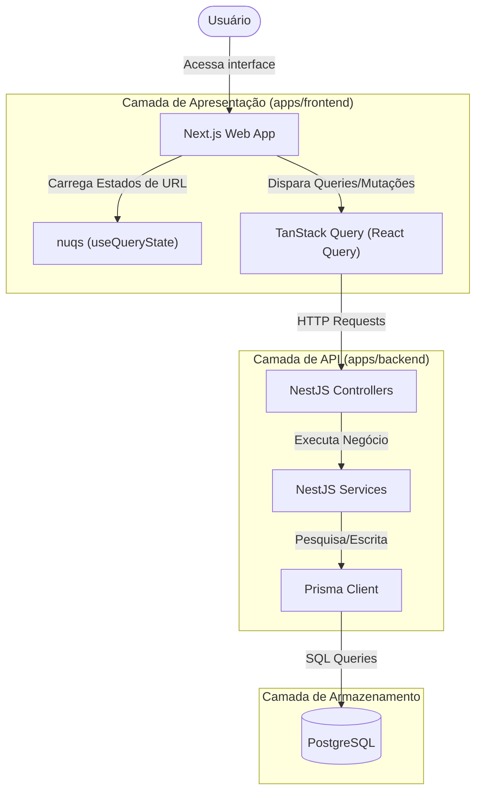

# 🏛️ Arquitetura do Sistema e Monorepo

Esta seção detalha a arquitetura geral do Scout, descrevendo a organização do código em monorepo, a injeção de dependência no backend e o fluxo reativo de dados no frontend.

---

## 📂 Estrutura de Pastas

O projeto utiliza um Monorepo gerenciado com **pnpm Workspaces** dividindo responsabilidades entre cliente e servidor:

```text
scout-monorepo/
├── apps/
│   ├── backend/          # Servidor NestJS, Scrapers e Prisma ORM
│   │   ├── prisma/       # Schema, Migrations e Client PostgreSQL
│   │   └── src/          # Rotas, Controllers, Services e Coletores
│   └── frontend/         # Web App Next.js + Tailwind CSS + Bloom UI
│       ├── public/       # Ícones SVG, Logos e Arquivos Estáticos
│       └── src/          # Componentes React, Queries e Hooks
```

---

## 🏛️ Fluxo de Dados e Comunicação

O Scout centraliza requisições reativas usando **TanStack Query** no frontend e **NestJS Modules** no backend:



---

## 💻 Frontend: Estado Reativo e Sincronização de Filtros

### 1. Sincronização via URL (`nuqs`)
- Para permitir o compartilhamento de buscas e manter consistência na recarga de páginas, todos os parâmetros da barra lateral (busca textual, empresa, período, origem, tipo de contrato, modalidades, níveis) são controlados diretamente no estado da URL através da biblioteca `nuqs`.
- Mudar um filtro atualiza instantaneamente a query string no navegador.

### 2. Cache Inteligente e Mutações Otimistas
- As requisições de listagem são cacheadas e atualizadas dinamicamente pelo TanStack Query.
- Ações rápidas de favoritar ou marcar vaga como candidata aplicam **mutações otimistas** no frontend (atualizam o estado da tela imediatamente). Se a requisição HTTP falhar no servidor, o frontend realiza o rollback automático do cache para o estado original, provendo uma UX ultra fluida.

---

## ⚡ Backend: Estrutura NestJS

A API do backend é modular e estruturada em torno de controladores e serviços:
- **`JobController` / `JobService`**: Controlam as operações principais sobre vagas de trabalho, cuidando da lógica de filtros booleanos estruturados, paginação SQL e o algoritmo de Jaccard por palavras para deduplicação fuzzy.
- **`CollectController` / `CollectService`**: Responsáveis por gerenciar o ciclo de sincronização, raspagem incremental (Scrapers) e o cruzamento dos novos registros com os filtros salvos de usuários para disparar notificações.
- **`AuthController` / `AuthService`**: Gerencia autenticação via JWT, persistência dos filtros salvos e armazenamento/recuperação do currículo Lume (`resumeJson`).
- **`NotificationController` / `NotificationService`**: Expõe rotas para gerenciar alertas in-app gerados em tempo real na coleta de vagas.

### 3. Documentação Automática da API (Scalar)
- A API do backend possui documentação interativa baseada na especificação OpenAPI (Swagger).
- A interface de exploração Scalar está disponível na rota `/reference` do backend e todos os endpoints estão descritos com títulos e resumos em inglês para manter o padrão técnico internacional de documentação.
