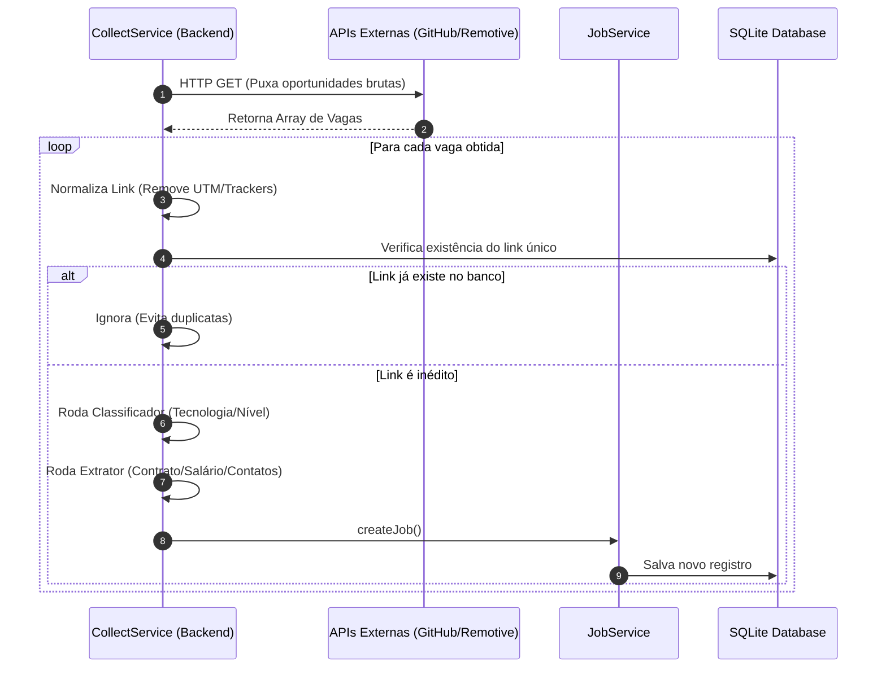

# 📥 Fluxo de Coleta de Vagas (Collectors)

O Scout adota um modelo extensível de **Coletores (Collectors)** para rastrear, mapear e centralizar vagas de múltiplas origens de forma incremental.

---

## 🏛️ Fluxo de Sincronização Incremental

O processo de coleta busca garantir a importação de novas oportunidades eliminando duplicatas e normalizando os dados em tempo real:

---

## 🚀 Detalhes dos Coletores Principais

### 1. GitHub Collector (`github-collector.ts`)
- **Funcionamento**: Consome a API pública de Issues do GitHub.
- **Ecossistema Focado**: Mapeia repositórios brasileiros especializados em compartilhamento de vagas (ex: `react-brasil/vagas`).
- **Normalização**: Converte o corpo em Markdown da Issue na descrição textual da vaga, capturando a data de publicação original e a URL.

### 2. Remotive Collector (`remotive-collector.ts`)
- **Funcionamento**: Consome a API pública da plataforma internacional Remotive.
- **Filtro Regional**: Para garantir que as vagas sejam úteis para desenvolvedores brasileiros, o coletor filtra em memória apenas oportunidades que aceitam candidatos localizados no **Brasil**, analisando termos como `"Worldwide"`, `"Brazil"`, `"LATAM"` ou `"South America"` no campo `candidate_required_location`.

### 3. Outros Coletores Integrados
- O sistema conta com coletores genéricos adicionais para raspar e unificar vagas de portais como **Gupy**, **Sólides**, **Remotar** e **Jooble**.

---

## 🔗 Normalização de Links (Mitigação de Duplicidade)
Antes de verificar a duplicidade no banco, as URLs são limpas. Parâmetros de rastreamento comuns (ex: `utm_source`, `utm_medium`, `utm_campaign`, `ref`, `sid`) são removidos. Isso garante que a mesma vaga listada com links ligeiramente diferentes em provedores distintos seja detectada e unificada corretamente.
