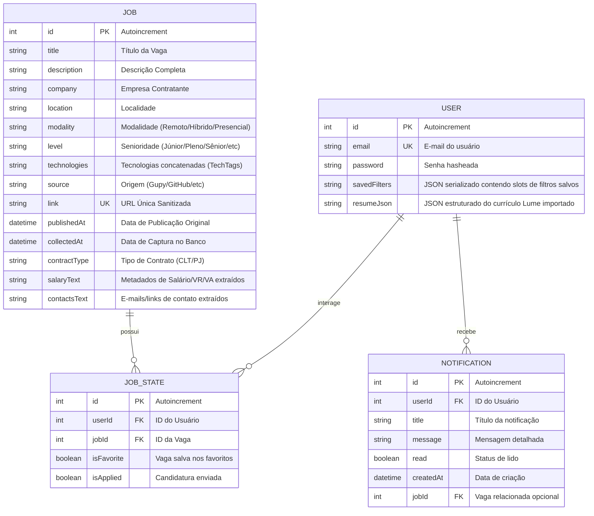

# 🗄️ Modelagem de Dados e Banco de Dados

O Scout utiliza um banco de dados local **SQLite** configurado e orquestrado por meio do **Prisma ORM**, facilitando transações relacionais rápidas.

---

## 🏛️ Diagrama Entidade-Relacionamento (E-R)

O banco de dados armazena vagas de trabalho (`Job`) estruturadas e mantém uma tabela de relacionamento de estados do usuário (`JobState`) para controlar o status de favoritos e candidatura:

---

## 📑 Detalhe dos Campos Chave (Tabela Job)

| Campo          | Tipo     | Descrição                                                                                             |
| :------------- | :------- | :---------------------------------------------------------------------------------------------------- |
| `link`         | `String` | Chave única (Unique) contendo a URL da vaga após processo de normalização (remoção de UTMs e trackers) |
| `contractType` | `String` | Tipo de contrato inferido pela análise regex (CLT, PJ, CLT/PJ ou Não especificado)                    |
| `salaryText`   | `String` | Valores monetários catalogados (ex: `Salário: R$ 10.000 / VR: R$ 900`)                                 |
| `contactsText` | `String` | Lista de e-mails ou formulários externos separados por vírgula para candidatura direta                 |

---

## 🛠️ Configuração do Prisma 7

### Centralização em `prisma.config.ts`
Diferente das versões anteriores do Prisma, a versão 7 centraliza as definições dinâmicas de banco diretamente no arquivo `prisma.config.ts` localizado na raiz da pasta `apps/backend/`. A URL de conexão física do SQLite é lida das variáveis de ambiente e injetada no pipeline de compilação.
