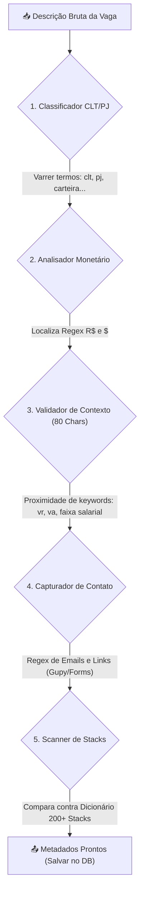

# 🧠 Motor de Extração de Metadados e Stacks

O Scout possui um processador lógico em **[`job-extractor.ts`](file:///c:/Users/Guilherme/Desktop/PROJETOS/CommitJobs/apps/backend/src/utils/job-extractor.ts)** que varre o texto completo da descrição de cada vaga para obter informações estruturadas de forma automática.

---

## 🏛️ Pipeline do Motor de Extração

Ao receber uma vaga bruta, a descrição textual passa pelas seguintes etapas sequenciais de análise e classificação:

---

## 🚀 Módulos e Algoritmos de Triagem

### 1. Classificação de Contratos (CLT vs PJ)
Varre a descrição usando padrões regex insensíveis a maiúsculas para detectar termos como:
- **PJ**: `pj`, `prestador de serviço`, `pessoa jurídica`, `cooperado`.
- **CLT**: `clt`, `carteira assinada`, `efetivo`.
- Se ambos forem localizados, a vaga é marcada como **CLT/PJ**.

### 2. Analisador Monetário Contextual (Salário, VR, VA e Home Office)
Para evitar que valores de benefícios listados (ex: `VR de R$ 900,00`) poluam o campo de salário principal da vaga, o extrator realiza uma **análise de contexto de proximidade**:
1. Localiza a posição do valor monetário (ex: `R$ 10.500`) na string.
2. Recorta uma string de **80 caracteres imediatamente anteriores** àquele valor.
3. Avalia o peso de proximidade dos termos:
   - Se houver palavra-chave de salário (`salário`, `faixa salarial`, `remuneração`, etc.) ou se o valor for $\ge R\$ 1.500$ e não contiver outras chaves, é classificado como **Salário**.
   - Se houver `vr`, `refeicao` ou `refeição`, é classificado como **VR**.
   - Se houver `va`, `alimentacao` ou `alimentação`, é classificado como **VA**.
   - Se houver `home office`, `homeoffice` ou `internet`, é classificado como **Home Office**.

### 3. Scanner de Tecnologias (Dicionário 200+ Stacks)
- O Scout confronta o texto contra um dicionário mapeado cobrindo exatamente a lista das 200+ tecnologias fornecidas pelo usuário.
- **Checagem de Fronteira Estrita**: Para evitar falsos positivos com siglas curtas (como `go`, `c`, `git`), o parser aplica validações Regex estritas diferenciadas:
  - Para `c`, `go`, `git`, `npm` ou `yarn`, exige fronteira estrita de palavra (`\b`).
  - Para outras tecnologias, permite a não correspondência de caracteres alfanuméricos e caracteres especiais (ex: `next.js` ou `c#`).
- Nomes normalizados são exibidos em formato padronizado nos cards (ex: `react` $\rightarrow$ `React`, `aws` $\rightarrow$ `AWS`).

### 4. Capturador de Contatos e Candidatura Direta
- **E-mails**: Captura através de expressões regulares de e-mail tradicionais.
- **Formulários**: Detecta links que contenham domínios como `google.com/forms`, `forms.gle`, `typeform.com`, `forms.office.com` e links adicionais da `gupy.io` inseridos diretamente no corpo da descrição da vaga.
